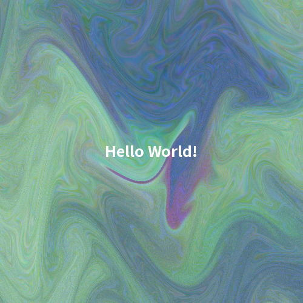
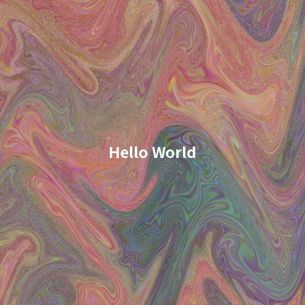

# ジェネレーティブサムネイル生成

タイトル文字列から決定論的な抽象画像を生成する CLI ツールです。
同じタイトル・同じオプションなら、毎回同じ画像パターンになります。



[その他の作品例はこちら](./ATELIER.md)

## 環境要件

- Python 3.12 以上
- 依存パッケージ: `numpy`, `Pillow`

## セットアップ

```bash
pip install -r requirements.txt
```

## 使い方

### 最小実行

```bash
python main.py "Hello World"
```

### 代表例

```bash
# 正方形（500x500）
python main.py "thumbnail" -s 500

# 長方形（800x450）
python main.py "thumbnail" -w 800 -h 450

# width だけ上書き（height は --size を使用）
python main.py "thumbnail" -s 500 -w 800

# テキスト付き
python main.py "Hello" -t -tp bl
```

## オプション

| Long | Short | 説明 | デフォルト |
| --- | --- | --- | --- |
| `--help` | なし | ヘルプを表示して終了 | なし |
| `--text` | `-t` | タイトルを画像に描画 | `False` |
| `--text-position` | `-tp` | テキスト配置位置（`center`, `top-left`, `top-right`, `bottom-left`, `bottom-right`, `c`, `tl`, `tr`, `bl`, `br`） | `center` |
| `--font-scale` | `-fs` | フォントサイズ比率（`min(width, height)` に対する比率） | `0.05` |
| `--size` | `-s` | 基本サイズ（正方形の基準値） | `500` |
| `--width` | `-w` | 出力横幅（指定時は `--size` より優先） | `None` |
| `--height` | `-h` | 出力縦幅（指定時は `--size` より優先） | `None` |
| `--output` | `-o` | 出力ディレクトリ | `output` |

### サイズ指定の仕様

- `--size N` のみ: `N x N`
- `--width W --height H`: `W x H`
- 片方だけ指定時:
  - `--size` があれば未指定側に `--size` を使用
  - `--size` がなければ未指定側は `500`
- `MIN_SIZE=16` 未満は `16` に補正

## 生成アルゴリズム（概要）

1. タイトルから `SHA-256` ハッシュを作成
2. ハッシュから色相・彩度・明度を決定（HSVベース）
3. ハッシュ由来の角度で座標軸を中心回転
4. ノイズ場と歪み場を合成して RGB パターンを生成
5. 必要ならタイトルテキストを白で描画

## 出力

- フォーマット: PNG（RGB）
- 保存先: `output/`（`-o` で変更可能）
- ファイル名: `yyyyMMdd_HHMMSS_<title>.png`

例:

```text
output/20260402_022515_aspect-fix.png
```

## ファイル構成

```text
.
├── README.md
├── main.py
├── requirements.txt
├── .gitignore
├── image/
│   └── sample.png
└── output/
```
