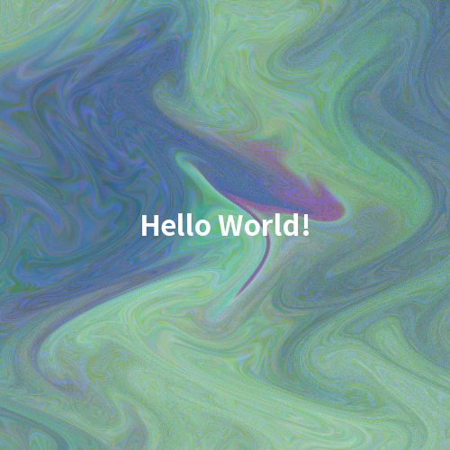

# ジェネレーティブデザインによるサムネイル生成

入力されたタイトルのハッシュ値を基に、抽象的なサムネイル画像を生成するプログラムです。同じタイトルを入力すると常に同じパターンが生成されます。



## 環境要件

- Python 3.8以上
- 必要なパッケージ：numpy, Pillow

## セットアップ

1. 依存パッケージをインストール

```bash
pip install -r requirements.txt
```

## 使用方法

### 基本的な使用法

タイトルをCLI引数として指定して実行します：

```bash
python main.py 'Hello World!'
```

### 実行例

```bash
$ python main.py "Hello World"
✓ サムネイル画像を生成しました
  タイトル: Hello World
  保存先: output/20260401_143025_Hello World.png
```

### テキスト付きで生成

```bash
$ python main.py "Hello" -t -tp bl
✓ サムネイル画像を生成しました
  タイトル: Hello
  保存先: output/20260401_143100_Hello.png
```

### オプション

| オプション        | 短形  | 説明                                         | デフォルト      |
| ----------------- | ----- | -------------------------------------------- | --------------- |
| `--text`          | `-t`  | タイトルを画像に描画する                     | False           |
| `--text-position` | `-tp` | テキストの描画位置                           | `center`        |
| `--font-scale`    | `-fs` | フォントサイズの比率（画像サイズに対する比） | `0.0625` (1/16) |
| `--size`          | `-s`  | 生成する画像のピクセルサイズ（正方形）       | `500`           |
| `--output`        | `-o`  | 出力ディレクトリ                             | `output`        |

### テキスト配置位置

`--text-position` で指定できる値：

- `center` または `c` : 中央
- `top-left` または `tl` : 左上
- `top-right` または `tr` : 右上
- `bottom-left` または `bl` : 左下
- `bottom-right` または `br` : 右下

### 使用例

```bash
# 500x500 の画像を生成
python main.py "thumbnail" -s 500

# テキスト付き、左下に配置
python main.py "generative" -t -tp bottom-left

# カスタムフォントサイズ
python main.py "タイトル" -t -fs 0.1

# 別のディレクトリに出力
python main.py "テスト" -o ./thumbnails
```

## 画像生成の特性

- 同じタイトルを入力すると、常に同じ画像が生成されます
- ランダムな抽象パターンはタイトルのハッシュ値から決定されます
- テキストは白色で描画されます
- 生成された画像はPNG形式で保存されます
- ファイル名は `YYYYMMDD_HHMMSS_タイトル.png` の形式です

画像のパターンは同じになりますが、ファイルのタイムスタンプは異なります。

## 出力

生成されたサムネイル画像は`output/`ディレクトリに保存されます：

```
output/20240401_143025_素晴らしいプロジェクト.png
```

ファイル名形式：`yyyyMMdd_HHMMSS_タイトル.png`

## 仕様

### ハッシュ値の利用

- タイトルのSHA-256ハッシュ値を計算
- ハッシュ値をもとに色、図形の位置、サイズを決定
- 同じタイトルから常に同じパターンを生成

### ノイズとパターン生成

- ハッシュ値からランダムシードを生成
- ランダムノイズを加えてユニークな外観を実現
- ハッシュ値から決まる数の円と四角形を配置
- ランダムなラインを追加

### 画像仕様

- サイズ：128x128ピクセル
- フォーマット：PNG（RGB色）
- 生成要素：カラーグラデーション、幾何学図形（円と四角形）、ランダムライン

## ファイル構成

```
.
├── README.md           # このファイル
├── main.py            # メインプログラム
├── requirements.txt   # 依存パッケージ
├── .gitignore        # Git無視ファイル
└── output/           # 生成されたサムネイル画像（自動作成）
```

## 技術詳細

### 使用ライブラリ

- **Pillow**: 画像の生成と保存
- **NumPy**: 数値計算と画像テンソル操作
- **hashlib**: タイトルのハッシュ値計算

### アルゴリズム

1. タイトルからSHA-256ハッシュを生成
2. ハッシュ値をランダムシードとして使用（決定論的）
3. 複数のレイヤーを重ねる：
    - グラデーションベース
    - ランダムノイズ
    - 幾何学的図形（円と四角形）
    - ランダムラインの追加

# 環境要件

- Python 3.12 以上
